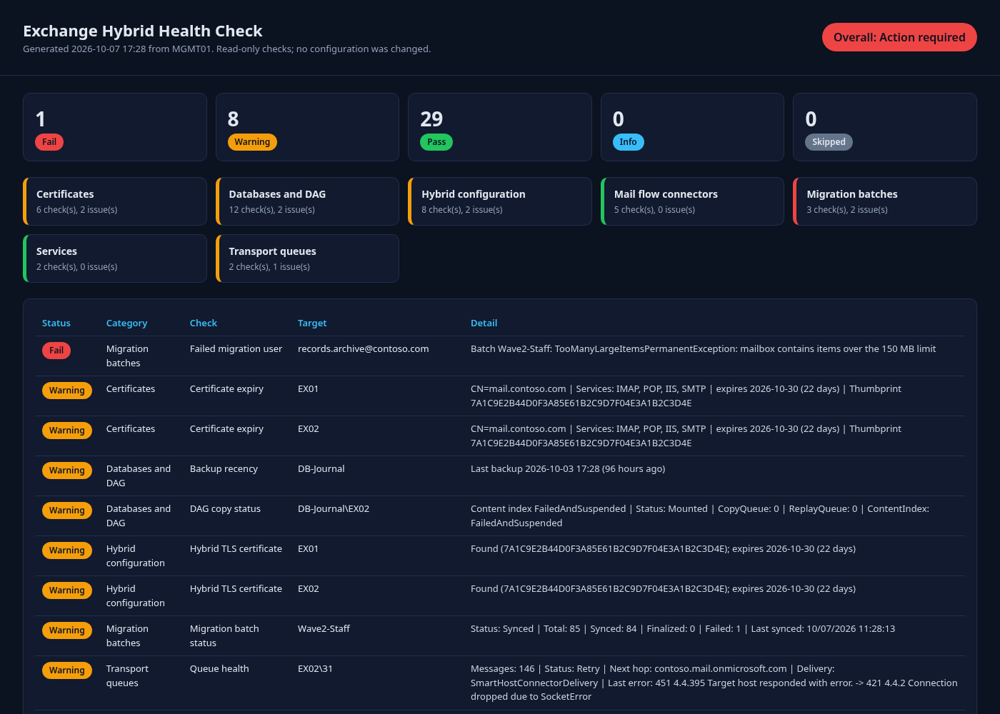

# Exchange Hybrid Health Check

[](https://github.com/john-harrington-it/exchange-hybrid-healthcheck/actions/workflows/ci.yml)


-informational)


A **read-only** PowerShell health check for Exchange Server 2016/2019 hybrid deployments with Exchange Online. It covers certificates, hybrid configuration, connectors, migration batches, queues, DAG and database health, and services, and produces a single HTML dashboard.



## The problem

A hybrid Exchange deployment depends on many parts that have to keep working together. An expired certificate, a disabled OAuth connector, a hybrid send connector that lost its TLS settings, a stuck migration batch, or a DAG copy that quietly failed can break mail flow, free/busy, or mailbox moves. Usually someone notices only when users complain. Checking all of it by hand means running dozens of cmdlets across two shells.

I've done Exchange 2010 → 2016 → 2019 migrations and run a hybrid with Exchange Online. This module packages those checks into one repeatable command that changes nothing, so it's safe to run as a scheduled task.

## What it checks

| Category | Command | Checks |
|---|---|---|
| Certificates | `Test-EhcCertificate` | Expiry of every service-bound certificate on every 2016/2019 mailbox server (warning/critical thresholds) |
| Hybrid configuration | `Test-EhcHybridConfiguration` | Hybrid config object and features. Hybrid TLS certificate present on each sending and receiving server, and its expiry. Organization relationships and free/busy on both sides. OAuth intra-organization connector on both sides. OnPremisesOrganization object in Exchange Online. |
| Mail flow connectors | `Test-EhcConnector` | Send connector to `*.mail.onmicrosoft.com` (enabled, RequireTLS, DomainValidation, certificate). TLS certificate on the Default Frontend receive connector. Exchange Online OnPremises inbound and outbound connectors (enabled, TLS, smart hosts). |
| Migration batches | `Test-EhcMigrationBatch` | Batch status and failure counts, plus each failed user's error summary |
| Transport queues | `Test-EhcTransportQueue` | Retry queues with the last error, queue-size thresholds, poison queue |
| Databases and DAG | `Test-EhcDatabaseHealth` | Mount state. Backup recency (logs only truncate after a backup). DAG copy status, copy and replay queue lengths, content index state. |
| Services | `Test-EhcServiceHealth` | `Test-ServiceHealth` required services on every server |
| Everything | `Invoke-EhcHealthCheck` | Runs the selected checks and writes `index.html`, `results.csv`, `results.json`, `run.log` |

Every result has the same shape: `Category`, `Check`, `Target`, `Status` (`Pass` / `Warning` / `Fail` / `Info` / `Skipped`), `Detail`, and `Timestamp`. You can filter it, export it, or open tickets from it.

## Requirements

- Windows PowerShell 5.1 or PowerShell 7.x
- **On-premises:** Exchange Management Shell on a 2016/2019 server or management host (local or remote PowerShell session). A read-only role such as View-Only Organization Management covers most checks. Confirm in your RBAC model that it also grants `Get-Queue` and `Test-ServiceHealth`.
- **Exchange Online:** the `ExchangeOnlineManagement` module, connected **with a prefix** so cmdlet names don't collide with on-premises ones:

  ```powershell
  Connect-ExchangeOnline -Prefix Cloud     # default prefix expected by the module
  ```
  Use a read-only role such as View-Only Organization Management or Global Reader.

If a side isn't connected, its checks return `Skipped` instead of failing, so the tool also works on-premises-only or cloud-only.

## Install

```powershell
git clone https://github.com/john-harrington-it/exchange-hybrid-healthcheck.git
Import-Module ./exchange-hybrid-healthcheck/src/ExchangeHybridHealthCheck/ExchangeHybridHealthCheck.psd1
```

## Usage

```powershell
# From the Exchange Management Shell
Connect-ExchangeOnline -Prefix Cloud
Invoke-EhcHealthCheck -OutputPath C:\Reports\Exchange

# Just the problems, no files written
Invoke-EhcHealthCheck -NoReport | Where-Object Status -in 'Fail','Warning' |
    Format-Table Status, Category, Check, Target, Detail -Wrap

# Single checks with custom thresholds
Test-EhcCertificate -WarningDays 45 -CriticalDays 21
Test-EhcTransportQueue -Server EX01, EX02 -WarningThreshold 50
Test-EhcDatabaseHealth -BackupWarningHours 26
Test-EhcMigrationBatch -IncludeFailedUser

# Any results → dashboard
Test-EhcConnector | Export-EhcHtmlReport -Path .\connectors.html

# Custom prefix
Connect-ExchangeOnline -Prefix EXO2
Invoke-EhcHealthCheck -CloudPrefix EXO2
```

[`examples/scheduled-healthcheck.ps1`](examples/scheduled-healthcheck.ps1) shows a scheduled run that opens a Kerberos remote session to Exchange and uses certificate-based app-only auth for Exchange Online, so no passwords are stored.

## Sample output

Generated from **synthetic data** (contoso.com). Open [`docs/sample-dashboard.html`](docs/sample-dashboard.html) for the interactive version (click a status card to filter). Console view, trimmed:

```text
Status  Category             Check                                Target
------  --------             -----                                ------
Fail    Migration batches    Failed migration user                records.archive@contoso.com
Warning Certificates         Certificate expiry                   EX01
Warning Transport queues     Queue health                         EX02\31
Warning Databases and DAG    Backup recency                       DB-Journal
Warning Hybrid configuration Hybrid TLS certificate               EX01
Warning Migration batches    Migration batch status               Wave2-Staff
Warning Databases and DAG    DAG copy status                      DB-Journal\EX02
Pass    Mail flow connectors Send connector to Exchange Online    On-premises: Outbound to Office 365 - contoso
Pass    Hybrid configuration OAuth (intra-organization connector) Exchange Online: HybridIOC - contoso
Pass    Services             Required services                    EX01
...
```

## Safety notes

- **Read-only by design.** The module only calls `Get-*` and `Test-*` Exchange cmdlets. A unit test parses the source and **fails the build** if any state-changing cmdlet (`Set-`, `New-`, `Remove-`, `Enable-`, `Mount-`, `Resume-`, `Retry-`, …) shows up outside a short allowlist of local report-writing commands.
- The only files it writes are the report files in `-OutputPath` (skipped with `-NoReport`).
- If a check throws, the error is recorded as a `Fail` result and the remaining checks still run.
- All values are HTML-encoded in the dashboard.
- Lagged DAG copies are supposed to have long replay queues. Review those results, or narrow `-Server`.

## Testing

Every Exchange cmdlet is stubbed and mocked, so the suite needs no Exchange server or tenant:

```powershell
./build.ps1   # PSScriptAnalyzer (0 findings required) + Pester with code coverage
```

Coverage includes status mapping for every check, prefix handling, skipped behavior when not connected, error isolation in the orchestrator, report outputs, HTML encoding, the read-only guarantee, and help for every exported command.

## Layout

```text
src/ExchangeHybridHealthCheck/   manifest, loader, Public/ (checks) and Private/ (helpers, dashboard renderer)
tests/                           Pester 5 tests with mocked Exchange cmdlets + quality gates
examples/                        scheduled run with app-only auth
docs/                            sample dashboard (synthetic data)
```

## Author

**John Harrington**, Systems Engineer. [LinkedIn](https://www.linkedin.com/in/john-harrington-9022649a)

## License

[MIT](LICENSE)
